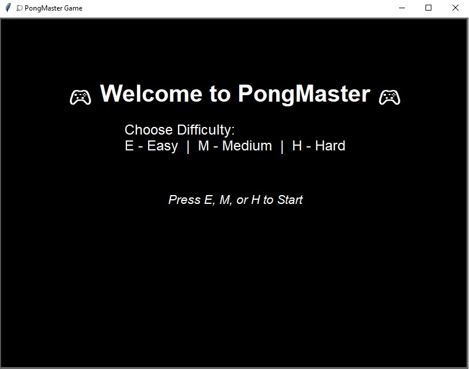

# 🏓 PongMaster


A fun and interactive two-player Pong game built using Python's `turtle` module. Choose your difficulty level and enter your name to personalize your match. First to 10 points wins!

---

## 🎮 Features

- 🏓 Paddle and ball interaction  
- ⚡ Ball speed varies by difficulty (Easy / Medium / Hard)  
- 🧍 Player name input directly on screen  
- 📈 Real-time score tracking  
- 🏁 First to 10 points wins  
- 🎨 Visually enhanced UI with colors and game feel  
- 🔄 Replay option after game ends  

---

## 📸 Game Preview



---

## 🚀 How to Run

1. Make sure Python 3 is installed.
2. Clone or download this repository.
3. Navigate to the project directory in your terminal or command prompt.
4. Run the game:

To run the `PongMaster.py` script, use the following command in your terminal:

```bash
python PongMaster.py
```

# 🎯 Gameplay Objective
Your goal is simple: be the first to reach 10 points!  
Block the ball using your paddle and try to outscore your opponent.

## 🎮 Controls

### Player 1
- **W** → Move Paddle Up  
- **S** → Move Paddle Down

### Player 2
- **↑ (Up Arrow)** → Move Paddle Up  
- **↓ (Down Arrow)** → Move Paddle Down

## 🧠 Game Logic Overview
- Ball bounces off walls and paddles using basic geometry.
- Score increments when the ball passes a player’s paddle.
- Ball speed increases slightly with each rally (in harder modes).
- Paddle collision detection ensures realistic movement.

## 🧪 Testing Instructions
- 🧪 Test all three difficulty modes and their speed differences.
- ✅ Verify score tracking and win condition at 10 points.
- 🧍‍♂️ Try different name combinations for both players.
- 🕹️ Check paddle movement responsiveness on both players' controls.

## 🧩 Customization Tips
Want to make it your own? Here’s how:

### 🎨 Change Colors
Modify paddle and background colors in the code.

### 🎵 Add Sound
Use `winsound` (Windows only) or `pygame` for cross-platform sound.

### 🕹️ Single Player Mode
Add basic AI for paddle movement.

### 🧑‍💻 New Win Logic
Make it time-based or rally-based if you want a twist.

## 🛠️ Requirements
- Python 3.x
- No external libraries needed (uses built-in `turtle` module)

## ✅ To-Do / Improvements
- Add single-player mode with AI
- Add sound effects
- Add pause and restart functionality
- Store high scores using files or JSON
- Add game timer or round-based mode

## 👥 Contribution Guidelines
Contributions are welcome! Here's how:

1. Fork the repo
2. Create your feature branch: `git checkout -b feature/YourFeatureName`
3. Commit your changes: `git commit -m 'Add YourFeatureName'`
4. Push to the branch: `git push origin feature/YourFeatureName`
5. Open a Pull Request 🚀

## 📄 License
This project is licensed under the MIT License — feel free to use, modify, and share!

## 😊 Final Words
Classic arcade experience with a colorful twist.  
Challenge your friends, master the paddle, and become the true PongMaster!  
Have fun and happy coding! 🏓💻

